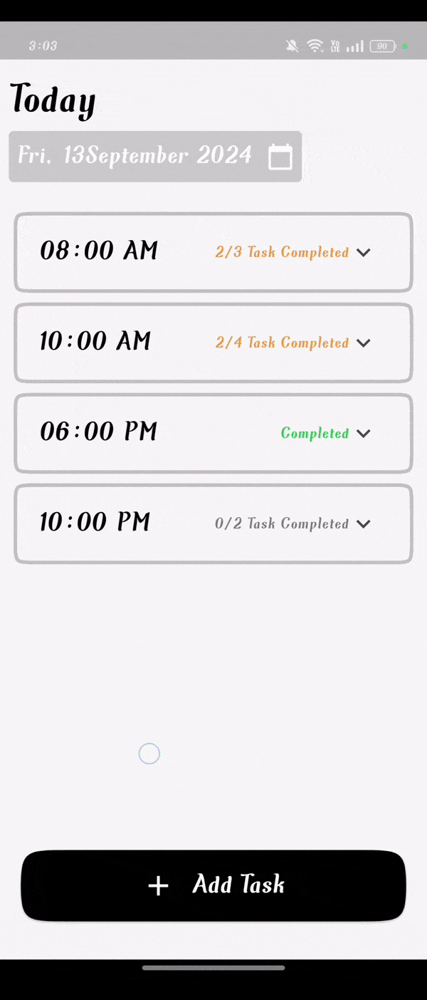
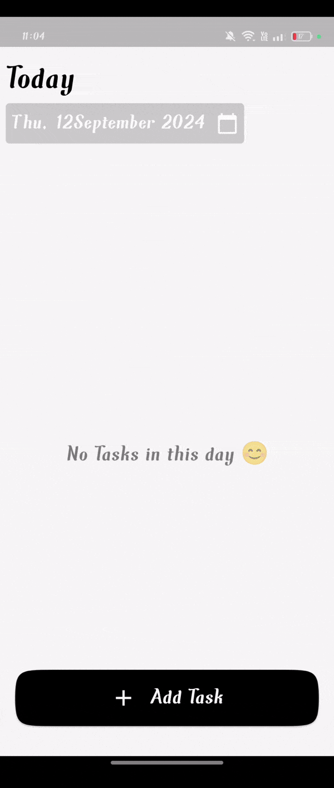
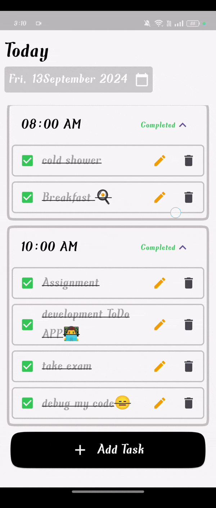

# Flutter To Do APP

This project is a **sample Flutter To Do application** that integrates **SQLite for local data storage** and uses **Cubit for state management**. It allows users to create tasks and sub-tasks, with features like form validation and saving data to the local SQLite database. The app is designed to offer a clean, simple user interface with responsive interactions and persistent data storage for tasks.

## Features

- **Task Management**: Create, view, update, and delete tasks.
- **Sub-Task Support**: Add sub-tasks for each task and manage them individually.
- **Local Storage with SQLite**: All tasks and sub-tasks are saved locally using SQLite, ensuring data persistence.
- **State Management with Cubit**: The app is built using Cubit for efficient state management across different views.
- **Form Validation**: Custom validation for task inputs, ensuring proper data entry.
- **Expandable Task View**: Tasks are displayed in an expandable tile format, revealing sub-tasks when expanded.

## Demo

### UI Overview


### Adding Tasks


### Data Saved Locally


## Project Structure

The project is organized into a modular structure, separating the UI components, Cubits, and SQLite operations for scalability and maintainability.

### Cubits Used

- **TasksViewCubit**: Handles task retrieval and management from the SQLite database.
- **TaskCubit**: Manages individual task state, including expansion and sub-task operations.
- **AddTaskCubit**: Manages the form state for adding tasks, including validation and submission.
- **SubTaskCubit**: Manages state for each sub-task within a task.

## Key Widgets

### `HomeView`

The **HomeView** is the main entry point of the app, where users can view all tasks and add new ones. It includes a floating button that opens the task creation form in a bottom sheet.

```dart
class HomeView extends StatelessWidget {
  const HomeView({super.key});

  @override
  Widget build(BuildContext context) {
    return BlocProvider(
      create: (context) => TasksViewCubit(),
      child: const Stack(
        alignment: Alignment.bottomCenter,
        children: [
          HomeScaffoldViewWidget(),
          HomeFloatBottomViewWidget(),
        ],
      ),
    );
  }
}
```

### `CustomExpansionTileTaskWidget`

This widget displays tasks in an expandable format. When expanded, it reveals the associated sub-tasks. The widget also handles task deletion through long-press interactions.

```dart
class CustomExpansionTileTaskWidget extends StatelessWidget {
  const CustomExpansionTileTaskWidget({
    super.key,
    required this.title,
    required this.taskIndex,
  });

  final String title;
  final int taskIndex;

  @override
  Widget build(BuildContext context) {
    BlocProvider.of<TaskCubit>(context)
        .reset(BlocProvider.of<TasksViewCubit>(context).tasksModel![taskIndex]);
    return BlocConsumer<TaskCubit, TaskState>(
      listener: (context, state) {
        // Listener for task state changes
      },
      builder: (context, state) {
        return GestureDetector(
          onLongPress: () {
            BlocProvider.of<TasksViewCubit>(context)
                .deleteTaskWithDialog(context, taskIndex);
          },
          child: ExpansionTile(
            controller: BlocProvider.of<TaskCubit>(context).controller,
            backgroundColor: const Color(0xfff7f7f7),
            title: Text(
              title,
              style: AppStyle.styleBold18,
            ),
            children: generateSubTaskWidgets(context, taskIndex),
          ),
        );
      },
    );
  }
}
```

### `AddTaskFormWidget`

This widget provides a form to create new tasks. It includes fields for task name, date, time, and sub-tasks, with validation and submission handled by the `AddTaskCubit`.

```dart
class AddTaskFormWidget extends StatelessWidget {
  const AddTaskFormWidget({super.key});

  @override
  Widget build(BuildContext context) {
    return BlocConsumer<AddTaskCubit, AddTaskState>(
      listener: (context, state) {
        if (state is AddTaskSuccess) {
          BlocProvider.of<TasksViewCubit>(context).dateTime =
              BlocProvider.of<AddTaskCubit>(context).taskModel.dateTime;
          BlocProvider.of<TasksViewCubit>(context).getTasksByDateDate();
          Navigator.pop(context);
        }
      },
      builder: (context, state) {
        return Padding(
          padding: const EdgeInsets.symmetric(horizontal: 18),
          child: Form(
            key: BlocProvider.of<AddTaskCubit>(context).formKey,
            autovalidateMode:
                BlocProvider.of<AddTaskCubit>(context).autovalidateMode,
            child: Column(
              children: [
                DataPickerWidget(
                  title: "Date",
                  customTextFormFieldWidget: CustomTextFormFieldWidget(
                    width: 220,
                    controller:
                        BlocProvider.of<AddTaskCubit>(context).dateController,
                    onTap: () async {
                      BlocProvider.of<AddTaskCubit>(context).getDate(context);
                    },
                    prefixIcon: Icons.calendar_today,
                    validator: (value) {
                      if (value == null || value.isEmpty) {
                        return "Enter Date";
                      }
                      return null;
                    },
                  ),
                ),
                const SizedBox(height: 12),
                DataPickerWidget(
                  title: "Time",
                  customTextFormFieldWidget: CustomTextFormFieldWidget(
                    width: 220,
                    controller:
                        BlocProvider.of<AddTaskCubit>(context).timeController,
                    onTap: () async {
                      BlocProvider.of<AddTaskCubit>(context).getTime(context);
                    },
                    prefixIcon: Icons.access_time,
                    validator: (value) {
                      if (value == null || value.isEmpty) {
                        return "Enter Time";
                      }
                      return null;
                    },
                  ),
                ),
                const SizedBox(height: 12),
                const AddSubTaskForm(),
                const SizedBox(height: 12),
                state is AddTaskFailure
                    ? Center(
                        child: Text(
                          state.errorMessage,
                          style: TextStyle(
                            color: Colors.red[700],
                          ),
                        ),
                      )
                    : const SizedBox(),
                CustomElevatedButtonWidget(
                    textName: "Confirm",
                    onPressed: () async {
                      await BlocProvider.of<AddTaskCubit>(context)
                          .confirmTask();
                    }),
                const SizedBox(height: 12),
              ],
            ),
          ),
        );
      },
    );
  }
}

```

## Getting Started

### Prerequisites

- [Flutter SDK](https://flutter.dev/docs/get-started/install)
- A code editor like [VS Code](https://code.visualstudio.com/) or [Android Studio](https://developer.android.com/studio)

### Installation

1. **Clone the repository**:
   ```bash
   git clone https://github.com/AdhamElagaty/sample_to_do_app_ui.git
   cd sample_to_do_app_ui
   ```

2. **Install dependencies**:
   ```bash
   flutter pub get
   ```

3. **Run the app**:
   ```bash
   flutter run
   ```

---